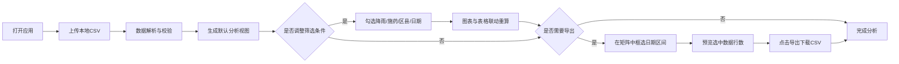

## 1. 产品概述
稻飞虱诱虫灯诱捕量周环比分析Web应用，服务于市植保站病虫害监测人员，通过本地CSV数据进行多维度可视化分析，辅助稻飞虱虫情研判与防控决策。

- 核心目标：提供直观的周环比趋势分析，快速识别虫情骤升区域与诱虫灯点位
- 目标用户：市/区县级植保站测报人员、病虫害防治技术人员

## 2. 核心特性

### 2.1 用户角色
| 角色 | 注册方式 | 核心权限 |
|------|----------|----------|
| 植保站分析员 | 无需注册，本地使用 | 上传CSV数据、查看所有分析模块、筛选、导出数据 |

### 2.2 功能模块
单页面应用，包含以下核心模块：
1. **数据上传区**：支持本地CSV文件拖拽/选择上传
2. **条件筛选栏**：日期区间、区县多选、降雨夜过滤、施药后3天内过滤
3. **周趋势折线图**：按区县聚合周诱捕总量，支持多区县叠加对比
4. **环比变动表**：本周vs上周同灯编号，增幅>50%标「骤升」
5. **灯号-日期矩阵**：行=诱虫灯编号，列=日期，单元格显示诱捕量，骤升格标红
6. **导出功能**：框选日期区间后导出明细CSV

### 2.3 页面详情
| 页面名称 | 模块名称 | 功能描述 |
|----------|----------|----------|
| 分析主页 | 顶部导航栏 | 应用标题、数据上传按钮、全局统计摘要卡片 |
| 分析主页 | 筛选控制栏 | 日期区间选择器、区县多选下拉、降雨开关、施药开关、重置按钮 |
| 分析主页 | 周趋势折线图 | 多系列折线图，X轴为自然周，Y轴为诱捕总头数，支持图例切换显示 |
| 分析主页 | 环比变动表 | 表格展示灯编号、所属区县、上周量、本周量、环比增幅、状态标签 |
| 分析主页 | 灯号-日期热力矩阵 | 交叉矩阵，鼠标悬停显示详情，骤升格红色高亮，数值色阶映射 |
| 分析主页 | 区间导出面板 | 拖拽选择日期范围，预览选中行数，一键导出CSV |

## 3. 核心流程
用户打开应用 → 上传包含监测数据的CSV文件 → 系统自动解析并生成默认视图（全部区县、最近8周）→ 用户按需勾选筛选条件（降雨夜/施药后/指定区县/日期范围）→ 所有图表与表格实时联动重算 → 用户在矩阵中框选日期区间 → 点击导出按钮下载明细CSV。

## 4. 用户界面设计

### 4.1 设计风格
- 主色：植保绿 `#2D6A4F`，辅助色：虫情橙 `#E76F51`，骤升警示红 `#D62828`，数据蓝 `#457B9D`
- 风格定位：**专业政务风 + 数据密度型**，强调信息层级与可读性
- 按钮风格：圆角矩形（8px），填充主色，hover加深阴影
- 字体：标题用「思源黑体 Bold」，表格与正文用「思源宋体 Regular」，数据表格数字用等宽字体
- 布局：顶部导航 + 下方两栏（上半区折线图，下半区左右分栏：环比表/矩阵）
- 图标：农业/病虫害主题的线性图标（稻穗、昆虫、灯、图表等）

### 4.2 页面设计概览
| 页面名称 | 模块名称 | UI要素 |
|----------|----------|--------|
| 分析主页 | 顶部摘要卡 | 4张卡片：监测总天数、覆盖区县数、诱虫灯总数、累计诱捕量，配微缩趋势线 |
| 分析主页 | 筛选栏 | 灰色背景容器，各筛选控件横向排列，状态标签实时显示当前筛选 |
| 分析主页 | 折线图区 | 白色卡片，带标题、图例悬浮、全屏切换按钮，网格线淡灰 |
| 分析主页 | 环比表 | 斑马纹行，增幅列颜色渐变色阶，「骤升」标签红色胶囊样式 |
| 分析主页 | 矩阵区 | 固定灯名列表头，日期列可横向滚动，鼠标悬停单元格放大效果 |
| 分析主页 | 导出面板 | 矩阵底部条带状区域，左右日期滑块 + 导出按钮 |

### 4.3 响应式
桌面端优先（>=1440px），最低支持1280px宽度；1024px以下切换为单栏垂直堆叠布局；矩阵区启用横向滚动条；不做移动端适配。

### 4.4 动效与交互
- 页面加载：各模块按上→下、左→右顺序淡入（stagger 80ms）
- 筛选变更：图表与表格数据切换用过渡动画（300ms ease）
- 矩阵单元格：hover时scale(1.05) + 阴影加深
- 骤升标记：呼吸光效（pulse 2s infinite）

