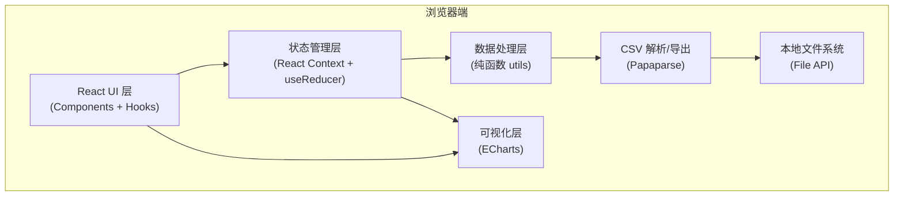

## 1. 架构设计
纯前端单页应用，无后端服务，所有数据处理在浏览器端完成。



## 2. 技术说明
- **前端框架**：React@18 + TypeScript + Vite
- **样式方案**：TailwindCSS@3 + CSS Variables
- **图表库**：ECharts@5（折线图、热力矩阵）
- **CSV处理**：PapaParse（解析+导出）
- **日期处理**：date-fns（周聚合、日期运算、区间判断）
- **状态管理**：React Context + useReducer（全局筛选状态、数据状态）
- **UI组件**：原生React组件 + Tailwind（不引入重型UI库以保持轻量）
- **数据来源**：用户本地上传CSV，内置mock示例数据便于直接预览

## 3. 路由定义
单页应用，无前端路由。
| 路径 | 用途 |
|------|------|
| / | 分析主页（所有功能模块聚合） |

## 4. 数据模型

### 4.1 原始数据行（CSV字段映射）
```typescript
interface TrapRecord {
  date: string;           // 日期 YYYY-MM-DD
  district: string;       // 区县名称
  trapId: string;         // 诱虫灯编号
  count: number;          // 诱捕头数
  avgTemp: number;        // 当晚平均气温（摄氏）
  isRaining: 0 | 1;       // 是否降雨
  isPesticide: 0 | 1;     // 周边是否施药
}
```

### 4.2 衍生数据模型
```typescript
// 周聚合（区县维度）
interface WeeklyDistrictData {
  weekKey: string;        // "2026-W24"
  weekStart: string;
  weekEnd: string;
  district: string;
  totalCount: number;
}

// 环比（灯编号维度）
interface TrapWeekComparison {
  trapId: string;
  district: string;
  lastWeekCount: number;
  thisWeekCount: number;
  changeRate: number;     // 百分比小数，如 0.65 表示 65%
  isSurge: boolean;       // 增幅 > 50%
}

// 矩阵单元格数据
interface MatrixCell {
  trapId: string;
  date: string;
  count: number;
  isSurge: boolean;       // 该灯号该日相较上周同日是否骤升
}

// 全局筛选状态
interface FilterState {
  dateRange: [string, string] | null;
  selectedDistricts: string[];
  rainOnly: boolean;      // 仅降雨夜
  pesticideWithin3Days: boolean;  // 仅施药后3天内
}
```

### 4.3 数据处理核心函数
| 函数名 | 输入 | 输出 | 用途 |
|--------|------|------|------|
| `parseCSV` | File对象 | TrapRecord[] | 解析上传CSV，校验字段 |
| `aggregateByWeekAndDistrict` | records[], filters | WeeklyDistrictData[] | 折线图数据源 |
| `calcTrapWeekComparison` | records[], filters | TrapWeekComparison[] | 环比表数据源 |
| `buildMatrix` | records[], filters | {columns: string[], rows: string[], cells: MatrixCell[][]} | 矩阵数据源 |
| `filterRecords` | records[], filters | TrapRecord[] | 应用筛选条件 |
| `isPesticideWithin3Days` | record, allRecords | boolean | 判断某日是否在任一次施药后3天内 |
| `exportCSV` | records[] | Blob | 导出选中区间明细 |

## 5. 目录结构
```
zbx-102-1/
├── src/
│   ├── components/
│   │   ├── Header.tsx           # 顶部导航+摘要卡
│   │   ├── FilterBar.tsx        # 条件筛选栏
│   │   ├── WeeklyLineChart.tsx  # 区县周折线图
│   │   ├── ComparisonTable.tsx  # 环比变动表
│   │   ├── TrapDateMatrix.tsx   # 灯号×日期矩阵
│   │   ├── ExportPanel.tsx      # 区间导出面板
│   │   └── FileUploader.tsx     # CSV上传组件
│   ├── context/
│   │   └── DataContext.tsx      # 全局数据+筛选状态
│   ├── utils/
│   │   ├── csv.ts               # 解析导出
│   │   ├── dataProcess.ts       # 聚合、环比、矩阵构建
│   │   └── dateUtils.ts         # 周运算、日期格式化
│   ├── data/
│   │   └── mockData.ts          # 内置示例数据
│   ├── types/
│   │   └── index.ts             # 类型定义
│   ├── App.tsx
│   ├── main.tsx
│   └── index.css
├── public/
│   └── sample.csv               # 示例CSV（用户可下载参考格式）
└── package.json
```
